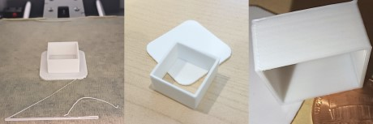
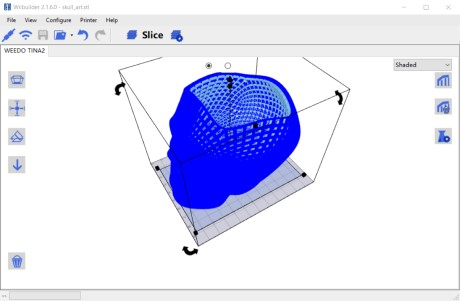

# [atet](https://github.com/atet) / [**_3dp_**](https://github.com/atet/3dp/blob/main/README.md#atet--3dp)

# 3D Printing

These are instructions to quickly 3D print something.

Excluding time to download, install dependencies, and waiting for your first 3D print to finish, _**you will be able to complete this tutorial in ~10 minutes**_

--------------------------------------------------------------------------------------------------

## Table of Contents

### Introduction

* [0. Preface](#0-preface)
* [1. Requirements](#1-requirements)
* [2. First Print](#2-first-print)
* [3. Models](#3-models)
* [4. Slicing](#4-slicing)
* [5. Printing](#5-printing)
* [6. Next Steps](#6-next-steps)

### Supplemental

* [Other Resources](#other-resources)
* [Troubleshooting](#troubleshooting)

--------------------------------------------------------------------------------------------------

## 0. Preface

***Here's the deal***: You'll either get a cheap 3D printer (<$100) and spend a lot of time troubleshooting or you'll invest in a higher quality one and not have as many headaches. Regardless, after considering consumables below, **3D printing *will* add up**.

Consumable | Price per Unit | Price per Print
--- | --- | ---
PLA Filament | ~$20/1kg spool | 20 × 50g prints = $1/print
Electricity | $0.30/kWh in California | 1kWh/10hr print = $0.30/print
 ‎ | ‎  | Total = **$1.30/print**

The 3D printer used in this tutorial is the Entina Tina2 Basic (~$150), a.k.a. WEEDO/WEEFUN Tina2, Monoprice MP Cadet, Bresser Raptor, etc. This printer is small, compact, and has auto-leveling capability which should make life a bit easier.

> Footprint of the Tina2 printer is 8¼" Length × 8¼" Width × 11½" Height with a printing area of 120 mm (4.7 inch) Length × 100 mm (3.9 inch) Width × 100 mm (3.9 inch) Height.

[Back to Top](#table-of-contents)

--------------------------------------------------------------------------------------------------

## 1. Requirements

You will need a computer to download or create 3D models and to "slice" them into instructions specifically for the Tina2's printing specifications.

The Tina2 Basic can only read files via a microSD card (8GB card and USB reader included) or direct connection to your computer via a USB cable (not included).

There will be a small spool of PLA filament included (100g), this will only be enough for a few large prints.

[Back to Top](#table-of-contents)

--------------------------------------------------------------------------------------------------

## 2. First Print

Unpack your printer, remove all protective materials, load the spool of filament through the side extruder clip (green arrow), pull up on the extruder clip (blue arrow), and pinch the end of the filament right between the metal teeth (red arrow). **Do not advance the filament past this point into the white filament guide tube**. Turn on the printer from the switch on the AC adapter cable and start the `Load Filament` process.

Since the printer comes with a microSD card preloaded with models, all you have to do for your first print is insert the microSD card in the slot to the left of the LCD screen, choose `Print from TF`, find the model you want to print, and *print*!

The model that should be printed first is the square test (`test-12min.gcode` file) to ensure the printer is working correctly. After the printer warms up, this will print in about 12 minutes and should come out relatively clean, square, and smooth.

> NOTE: You can remove the square from the support raft (middle panel).

[Back to Top](#table-of-contents)

--------------------------------------------------------------------------------------------------

## 3. Models

### Downloading Models

You can download free 3D models from Thingiverse (https://www.thingiverse.com). The file(s) you download with be `*.stl` files that must be "sliced", which turns the `*.stl` model into instructions specifically for the Tina2's printing specifications.

### Creating Your Own Models

Only basic manipulation of existing models (like orientation and scaling) can be performed in the slicing software in the next section. Further model creation is beyond the scope of this tutorial.

[Back to Top](#table-of-contents)

--------------------------------------------------------------------------------------------------

## 4. Slicing

The recommended slicing software for the Tina2 is the WiiBuilder2 program as it contains the specifications for this printer. You can download it from: https://download.entina3d.com/download/ENTINA-Wiibuilder-2.3.0.0-Win.zip

After installation, open `Wiibuilder.exe`, select `Printer`, and select `WEEDO TINA2` to load the correct printer settings.

Once you load an `*.stl` model, you can adjust orientation and even scale the model to make it smaller or larger. If you make the object too large, the program will warn you that it is beyond the Tina2's limits.

Once you're satisfied, click on the `Slice` button and wait for the program to convert the `*.stl` model into the `*.gcode` instructions for your Tina2 printer. Note that the estimated print time and amount of filament used is calculated on the bottom right.

[Back to Top](#table-of-contents)

--------------------------------------------------------------------------------------------------

## 5. Printing

Load your newly generated `*.gcode` file onto the microSD card, load it up on the printer, and print!

> Halfway done! 

> This print took over 10 hours to finish and used half of the included 100g filament spool.

[Back to Top](#table-of-contents)

--------------------------------------------------------------------------------------------------

## 6. Next Steps

Now that you have two prints under your belt, find more complex models or make your own; *the sky's the limit...or actually, 120×100×100 mm in this case*.

**TODO**: Add a picture of a more complex print I've made for the Raytheon Certified Innovator Program.

[Back to Top](#table-of-contents)

--------------------------------------------------------------------------------------------------

## Other Resources

Description | URL Link
--- | ---
Entina Tina2 Documents | https://www.entina3d.com/pages/download
WEEDO Tina2 Wiki | https://www.weedotina2.com/doku.php
Thingiverse | https://www.thingiverse.com

[Back to Top](#table-of-contents)

--------------------------------------------------------------------------------------------------

## Troubleshooting

Issue | Solution
--- | ---
**"I don't see my model files on the SD card when inserted in the printer."** | Ensure that the model's `*.gcode` file was copied and not the `*.stl` file
**"The printer is working but having issues with the print."** | Here are common 3D printer issues: https://www.simplify3d.com/resources/print-quality-troubleshooting
**"Printer doesn't seem to be working at all out of the box!"** | You should return or exhange the printer as it may not be worth repairing it
**"A ton of filament is coming out during `Load Filament` step!"** | Instead of pushing the filament all the way to the hotend nozzle (through the white filament guide tubing), only clamp it between the metal teeth of the extruder
**"It's not working!"** | This concise tutorial has distilled hours of sweat, tears, and troubleshooting; _it can't not work_

[Back to Top](#table-of-contents)

--------------------------------------------------------------------------------------------------

Copyright © 2023-∞ Athit Kao, <a href="http://www.athitkao.com/tos.html" target="_blank">Terms and Conditions</a>
